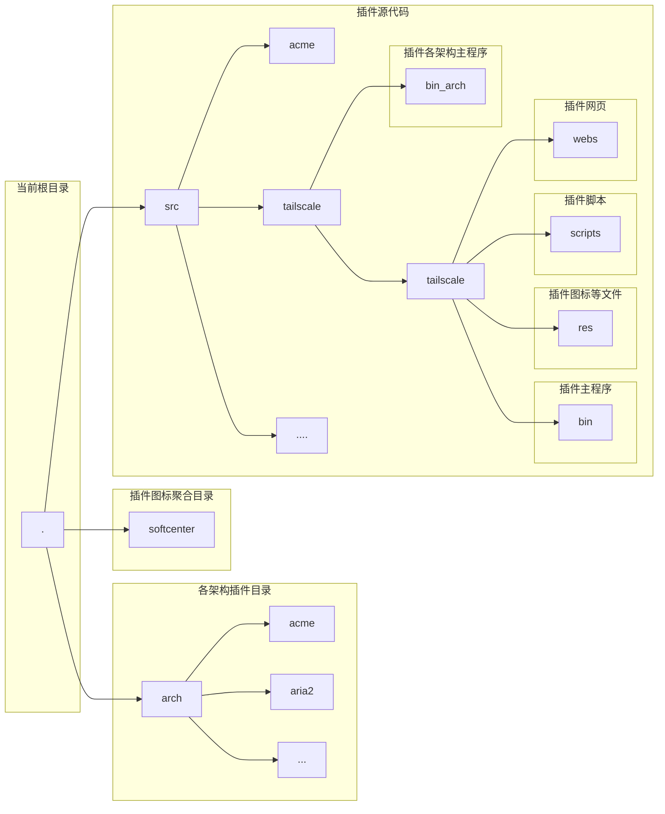

# 代码架构



## 多语言支持

web页面支持：
添加如下

````
<script type="text/javascript" src="/js/i18n.js"></script>
````

init()处添加

````
sc_load_lang("插件名");
````

然后在需要翻译处添加属性`sclang`


## 开发须知：

如果你是开发者，想要开发新的插件，并用离线包的方式进行传播，请了解以下内容：

1. 在程序方面：务必使用静态链接，每个架构的软件中心都对应不同内核版本和不同libc版本的固件，无法保证动态链接后的程序能正常运行，[工具链等](https://github.com/SWRT-dev/softcenter_tools)。
2. 多语言支持为可选项

**软件中心各架构列表：**

|  软件中心架构  |                     mips                     |                       arm                       |                        arm64                       |                        armng                        |                        mipsle                        |
| :---------: | :---------------------------------------------------: | :-----------------------------------------------------: | :---------------------------------------------------------: | :---------------------------------------------------------: | :-----------------------------------------------------------: |
|  CPU架构  |                         mips                         |                         armv7                        |                           aarch64                           |                           armv7                           |                            mipsle                            |
|  linux内核  |                       3.10/4.9                       |                        2.6.36.4                        |                      4.x/5.x                      |                         3.x/4.x/5.x                         |                         3.10/4.x/5.x                         |
|     CPU     |                        grx500                        |                        bcm4708/9                        |              [bcm49xx ][ipq][mt798x]              |            [bcm67xx][ipq]            |                            mtk7621                            |
|     FPU     |                         soft                         |                           no                           |                            hard                            |                            hard                            |                             soft                             |
|  固件版本  |                    SWRT 5.1.2+                    |                     SWRT 5.1.2+                     |                       SWRT 5.1.2+                       |                       SWRT 5.1.2+                       |                        SWRT 5.1.2+                        |
| 软件中心api |                 **1.5** 代                 |                  **1.5** 代                  |                    **1.5** 代                    |                    **1.5** 代                    |                     **1.5** 代                     |
| 代表机型-1 | [BLUECAVE](https://github.com/SWRT-dev/bluecave-asuswrt) |      [RT-AC68U](https://github.com/SWRT-dev/rtac68u)      |      [RT-AC86U](https://github.com/SWRT-dev/86u-asuswrt)      |      [TUF-AX3000](https://github.com/SWRT-dev/tuf-ax3000)      |      [RT-AC85P](https://github.com/SWRT-dev/ac85p-asuswrt)      |
| 代表机型-2 |      [K3C](https://github.com/SWRT-dev/K3C-merlin)      |       [K3](https://github.com/SWRT-dev/K3-merlin.ng)       |       [GT-AC2900](https://github.com/SWRT-dev/gt-ac2900)       |        [RT-AX58U](https://github.com/SWRT-dev/rt-ax58u)        |         [RT-AX53U](https://github.com/SWRT-dev/rtax53u)         |
| 代表机型-3 |    [RAX40](https://github.com/SWRT-dev/rax40-asuswrt)    |    [SBRAC1900P](https://github.com/SWRT-dev/sbrac1900p)    |          [R8000P](https://github.com/SWRT-dev/r8000p)          |        [RT-AX89X](https://github.com/SWRT-dev/rtax89x)        |        [R6800](https://github.com/SWRT-dev/ac85p-asuswrt)        |
| 代表机型-4 |                        DIR2680                        |     [RT-AC5300](https://github.com/SWRT-dev/rt-ac5300)     |                            RAX80                            |    [RT-ACRH17](https://github.com/SWRT-dev/acrh17-asuswrt)    |      [RM-AC2100](https://github.com/SWRT-dev/ac85p-asuswrt)      |

